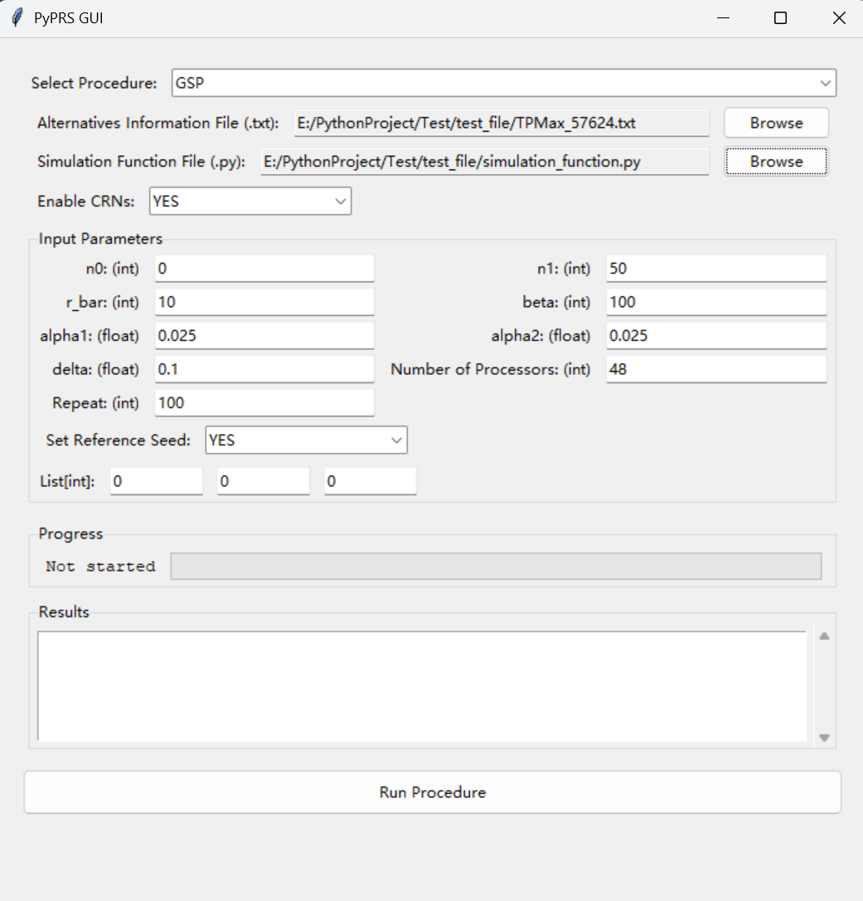
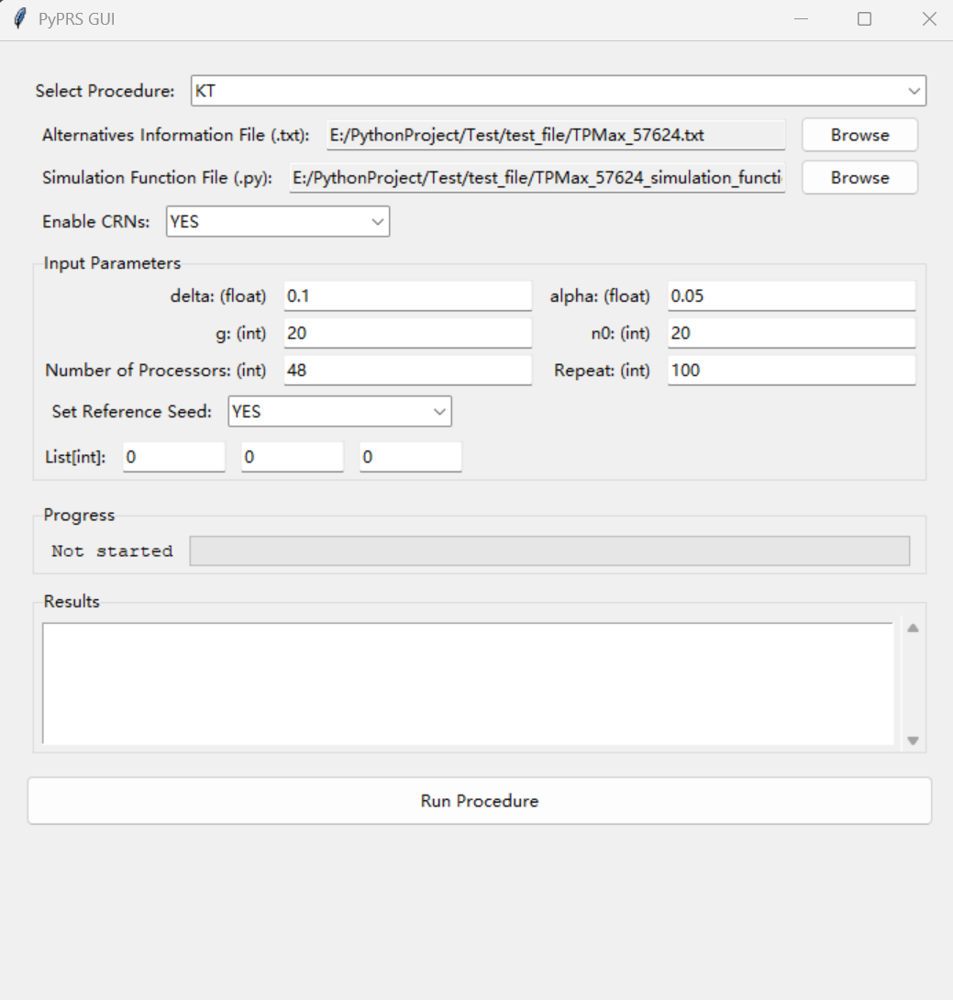
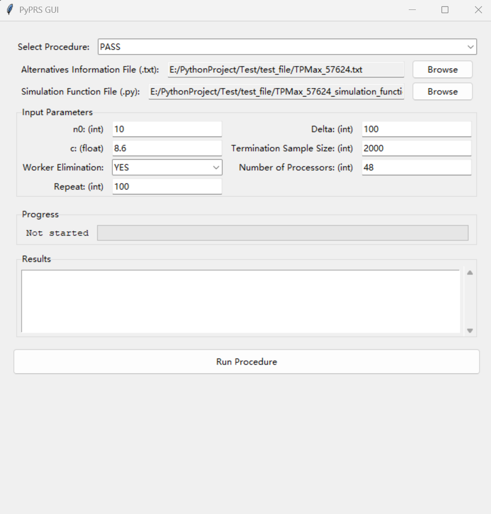
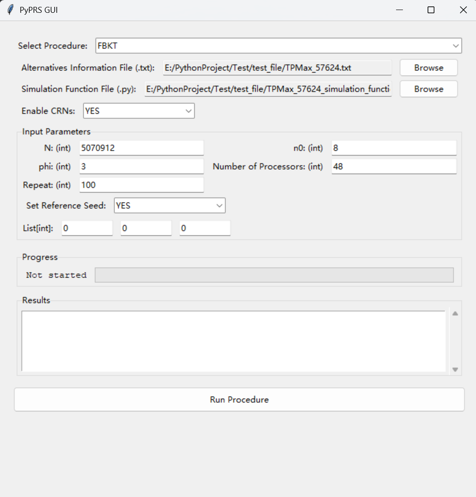
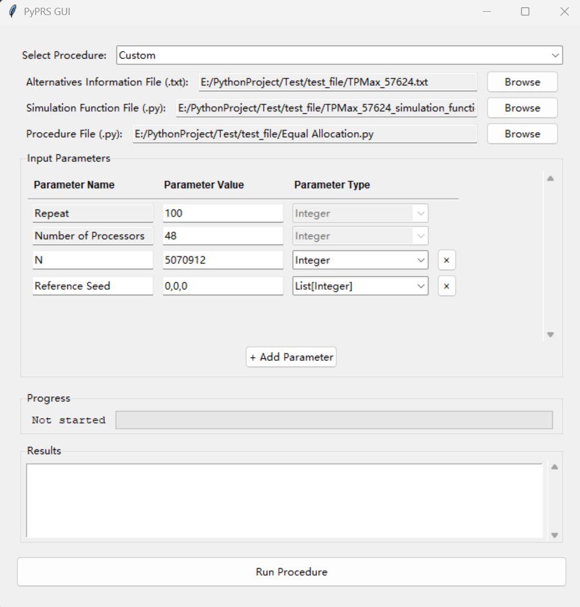

| [**Main Page**](../README.md) | [**How to Use PyPRS**](How%20to%20Use%20PyPRS.md) | [**Output**](Output.md) | [**A Demo Application**](A%20Demo%20Application.md) |
# The Throughput Maximization Problem

## 1 📝 Problem Description
The throughput maximization problem considers a flow line system with three stations, labeled as Stations 1, 2, and 3. There are infinitely many jobs waiting in front of Station 1, and each job moves sequentially through all three stations. The service times at Stations 1, 2, and 3 are independently drawn from exponential distributions with service rates $s_1$, $s_2$, and $s_3$ respectively. At Stations 2 and 3, there is finite buffer storage, denoted as $b_2$ and $b_3$ respectively. When the buffer at Station $i$, where $i = 2, 3$, is fully occupied, Station $i - 1$ is blocked and must hold the completed job until the job at Station $i$ is finished and released. The objective of this problem is to determine the optimal allocation of the service rate and the buffer to maximize the expected steady-state throughput of the flow line subject to constraints $s_1 + s_2 + s_3 = \mathcal{L}_1$,  $b_2 + b_3 = \mathcal{L}_2$, and $x=(s_1,s_2,s_3,b_2,b_3)\in Z$. Here, $\mathcal{L}_1$ and $\mathcal{L}_2$ represent problem-specific parameters that define the feasible solution set. The mathematical formulation of this problem is as follows:

$\max_{x} \mathbb{E}[f(x; \xi)]$

$\text{s.t.} \quad s_1 + s_2 + s_3 = \mathcal{L}_1$

$\quad\quad b_2 + b_3 = \mathcal{L}_2 $

$\quad\quad\quad  x=(s_1,s_2,s_3,b_2,b_3)\in Z$,

where $f(x; \xi)$ is the random throughput of the flow line. For every feasible solution, we obtain observations of $f(x; \xi)$ by running simulation experiments. For each simulation experiment, we warm up the system with 2,000 jobs. After 2,000 jobs are processed, we observe the throughput of the subsequent 50 jobs. In this demonstration, we let $\mathcal{L}_1=50$ and $\mathcal{L}_2=50$ resulting in 57,624 alternatives available in the problem. 

## 2 🔧 Using PyPRS to Solve the Problem

<a href="https://github.com/simulation-optimization/PyPRS/raw/refs/heads/main/files/Uploading%20Files.zip">Download Uploading Files</a>

*Note*: When the number of alternatives for a problem is very large, manually creating the **alternatives information file** can be time-consuming. In this problem, we use a <a href="https://github.com/simulation-optimization/PyPRS/raw/refs/heads/main/files/Generate%20Alternatives%20Information%20File.zip">Python function</a> to automatically generate the **alternatives information file**. Users can make slight modifications to this function to generate the file for other problems.

### 2.1 GSP
The screenshot below displays the PyPRS GUI during GSP execution:

After using GSP to solve the problem, the results are summarized in the table below, which reports the Probability of Correct Selection (PCS), Total Simulation Time (s), Total Sample Size, Wall-Clock Time (s), Utilization, and the 95% confidence intervals for the five metrics. Note that when calculating the PCS, if the mean of the selected best alternative is within $\delta$ to that of the true best alternative, we count it as a correct selection.

| Metric                    | Value       | 95% Confidence Interval |
|---------------------------|-------------|-------------------------|
| PCS                       | 1.00   | (1.00, 1.00)    |
| Total Simulation Time (s) |6395.47| (6799.03, 7071.92)    |
| Total Sample Size         | 12318493.35   |(12085948.57, 12551038.12)     |
| Wall-Clock Time (s)       | 178.73| (174.84, 182.62)        |
| Utilization (%)           | 80.94  |(80.64, 81.24)|

Users can download the summary and detailed results produced by PyPRS for GSP by clicking the link below:

<a href="https://github.com/simulation-optimization/PyPRS/raw/refs/heads/main/files/GSP%20Results.zip">Download Results for GSP</a>
### 2.2 The KT Procedure
The screenshot below displays the PyPRS GUI during the KT procedure execution:

After using the KT procedure to solve this problem, the results are summarized in the table below, which reports the PCS, Total Simulation Time (s), Total Sample Size, Wall-Clock Time (s), Utilization, and the 95% confidence intervals for the five metrics. Note that when calculating the PCS, if the mean of the selected best alternative is within $\delta$ to that of the true best alternative, we count it as a correct selection.

| Metric                    | Value       | 95% Confidence Interval |
|---------------------------|-------------|-------------------------|
| PCS                       | 1.00   | (1.00, 1.00)       |
| Total Simulation Time (s) |3358.40   |(3260.03, 3456.77)     |
| Total Sample Size         |6170721.28   | (5990884.66, 6350557.90)     |
| Wall-Clock Time (s)       |89.65 | (86.79, 92.51) |
| Utilization (%)           |78.22 |(77.64, 78.80)     |

Users can download the summary and detailed results produced by PyPRS for the KT procedure by clicking the link below:

<a href="https://github.com/simulation-optimization/PyPRS/raw/refs/heads/main/files/KT%20Results.zip">Download Results for KT</a>
### 2.3 The PASS Procedure
The screenshot below displays the PyPRS GUI during the PASS procedure execution:

  **注意是否修改**

After using the PASS to solve the problem, the results are summarized in the table below, which reports the average mean of the surviving alternatives, Total Simulation Time (s), Total Sample Size, Wall-Clock Time (s), Utilization, and the 95% confidence intervals for the five metrics. Note that for the PASS procedure, we report the average mean of the surviving alternatives instead of the PCS, as multiple alternatives may remain when the procedure terminates.

| Metric                              | Value       | 95% Confidence Interval |
|-------------------------------------|-------------|-------------------------|
| Average Mean of Surviving Alternatives | 15.6746| (15.6712, 15.6781)       |
| Total Simulation Time (s)           | 8100.6483     | (8067.8804, 8133.4162)      |
| Total Sample Size                   | 6344903.9700  | (6324625.1410, 6365182.7990)|
| Wall-Clock Time (s)                 | 296.6823      | (296.1064, 297.2583)|
| Utilization (%)                     | 56.88         |(56.68, 57.09)                |

Users can download the summary and detailed results produced by PyPRS for the PASS procedure by clicking the link below:

<a href="https://raw.githubusercontent.com/biazhong/test/refs/heads/main/files/Uploading%20Files.zip">Download Results for PASS</a> **修改**
### 2.4 The FBKT Procedure
The screenshot below displays the PyPRS GUI during the FBKT procedure execution:

After using the FBKT procedure to solve this problem, the results are summarized in the table below, which reports the PCS, Total Simulation Time (s), Total Sample Size, Wall-Clock Time (s), Utilization, and the 95% confidence intervals for the five metrics. Note that when calculating the PCS, if the mean of the selected best alternative is within $\delta$ to that of the true best alternative, we count it as a correct selection, where $\delta$ is the same as that used in GSP and the KT procedure.

| Metric                    | Value       | 95% Confidence Interval |
|---------------------------|-------------|-------------------------|
| PCS                       | 1.00    | ( 1.00, 1.00 )         |
| Total Simulation Time (s) |2621.55   |(2608.44, 2634.67)   |
| Total Sample Size         |4704528.00  | (4704528.00, 4704528.00)      |
| Wall-Clock Time (s)       |57.75| (57.46, 58.05) |
| Utilization (%)           |94.57   |(94.46, 94.68)    |

Users can download the summary and detailed results produced by PyPRS for the PASS procedure by clicking the link below:

<a href="https://github.com/simulation-optimization/PyPRS/raw/refs/heads/main/files/FBKT%20Results.zip">Download Results for FBKT</a>
### 2.5 The Custom Procedure

In this demo application, when implementing the custom procedure, we consider the equal allocation procedure. The procedure takes two additional input parameters, total sampling budget `N` and `Reference Seed`, in addition to `Repeat` and `Number of Processors`. The selection structure of the procedure is straightforward. At the start of the selection process, based on the total sampling budget set by the users, the procedure evenly allocates the simulation budget across all alternatives. Then, the alternatives are evenly distributed to all processors. Each processor generates simulation samples from the assigned alternatives, and the alternative with the highest sample mean is selected as the best. Users can directly download the procedure file for the equal allocation procedure by clicking the link below:

<a href="https://github.com/simulation-optimization/PyPRS/raw/refs/heads/main/files/Equal%20Allocation.zip">Download Procedure File</a>

The screenshot below displays the PyPRS GUI during the equation allocation procedure execution:

After using the equal allocation procedure to solve this problem, the results are summarized in the table below, which reports the PCS, Total Simulation Time (s), Total Sample Size, Wall-Clock Time (s), Utilization, and the 95% confidence intervals for the five metrics. Note that when calculating the PCS, if the mean of the selected best alternative is within $\delta$ to that of the true best alternative, we count it as a correct selection, where $\delta$ is the same as that used in GSP and the KT procedure.

| Metric                    | Value       | 95% Confidence Interval |
|---------------------------|-------------|-------------------------|
| PCS                       | 0.76    | (0.68, 0.84)        |
| Total Simulation Time (s) | 3631.39   | (3617.46, 3645.33)     |
| Total Sample Size         | 5070912.00   | (5070912.00, 5070912.00)      |
| Wall-Clock Time (s)       | 80.12  | (79.82, 80.42)         |
| Utilization (%)           |  94.43 | (94.35, 94.51)      |

Users can download the summary results produced by PyPRS for the equal allocation procedure by clicking the link below:

<a href="https://github.com/simulation-optimization/PyPRS/raw/refs/heads/main/files/Equal%20Allocation%20Results.zip">Download Results for the Equal Allocation Procedure</a>

